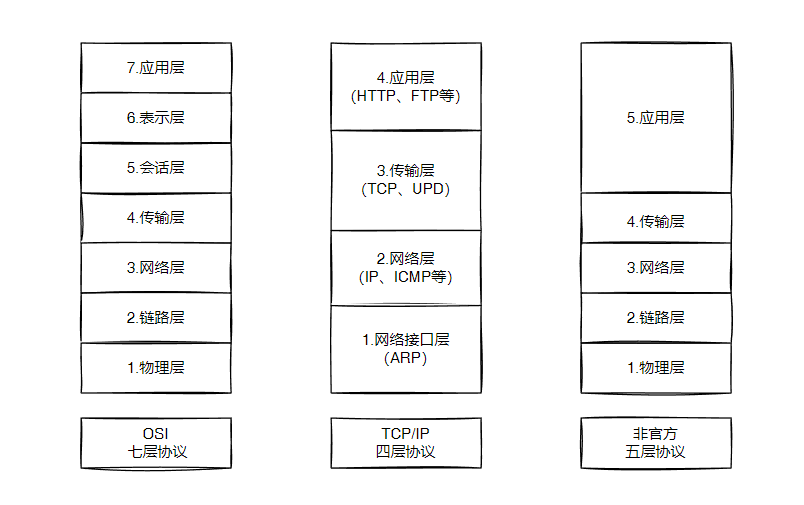
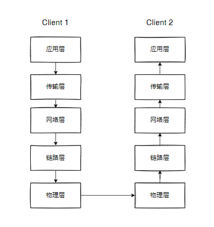
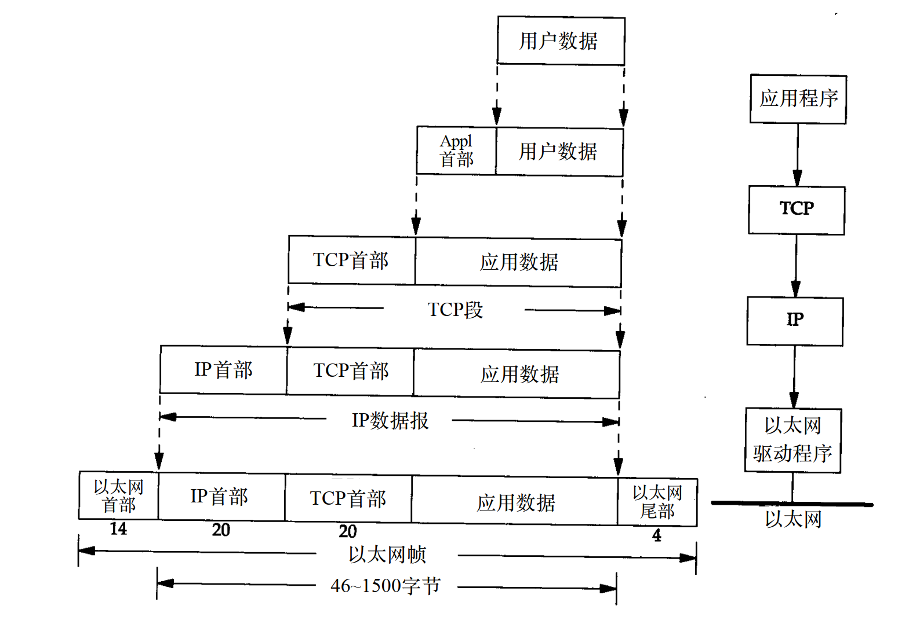

## 计算机网络体系结构

如果两台计算机之间要实现通信，不但要有一条传输数据的通路，还需要很多准备：

1. 发起通信的计算机先要确保通路的`激活`，即发出一些信令，保证要传送的计算机数据能够在该通路上`确保正确`发送和接收
2. 需要告诉网络如何`识别`哪个计算机来负责接收
3. 发起通信的计算机必须查明对方计算机是否已经开机、网络连接正常
4. 发起通信的计算机的应用必须确保：目标计算机的应用是否已经做好接收文件的准备
5. 若计算机的文件格式不兼容，需要至少一套计算机完成格式转换
6. 若出现差错，如传送错误、重复、丢失、结点故障，需要有可靠的措施保证目标计算机能够最终接收到正确的文件

要设计这样的网络，分层可以将复杂的问题转换为进一步若干较小的问题，但是各层也需要一定的标准规范来实现，
且分层在某种程度上也会造成冗余。

## 网络分层模型

### 分层模型图

各层所有的协议被称为协议栈，其层次划分如图所示：

OSI 七层模型分别是：物理层，链路层，网络层，传输层，会话层，展示层，应用层

TCP / IP 的四层模型分别是：网络接口层，网络层，传输层，应用层

课本中常说的五层模型则是将 OSI 七层模型的应用表示会话三层合并为应用层，即物理层，链路层，网络层，传输层，应用层

### 各层作用

以五层模型为：

TODO 精简一下

- **应用层**（application layer）：该层协议主要用来指定应用进程间通信和交互的规则
  - 该层信息分组称呼为**报文**（message）
  - 常见协议：HTTP（web 协议）、SMTP（邮件协议）、FTP 等（文件传输协议）、DNS（域名协议）
- **运输层**（transport layer）：该层协议主要为两台主机的进程之间通信提供数据传输服务，应用层可以利用该层服务传送报文。由于一台主机可以同时运行多个进程，因此传输层有复用、分用功能。复用就是多个应用进程可同时使用下层传输层服务，分用相反是传输层把收到的信息分别交付上层应用层的进程中。
  - 传输层分组在使用 TCP 协议时，传输的数据单位是**报文段**(segment)，使用 UDP 协议时，数据传输单位是**用户数据报**
  - 常见协议：TCP（面向连接）、UDP（无连接）
- **网络层**（network layer）：负责为分组交换网上不同的主机提供通信服务，发送数据时，网络层把运输层报文段/数据报封装为分组（packet，包）进行传送。此外网络层还负责选择合适的路由。
  - 网络层如果使用 IP 协议，该层数据传输单位称为**IP 数据报**（datagram）
  - 常见协议：IP 协议、ICPM 协议、IGMP 协议
- **数据链路层**（data link layer）：定义如何让格式化数据以帧为单位进行传输，控制对物理介质的访问，还提供错误检测和纠正，以确保数据的可靠传输。
  - 网络层的 IP 数据报在这里组装为**帧**（framing），以使得相邻结点链路上传送帧。每一帧都包括数据和必要的控制信息（同步信息、地址信息、差错控制）
- **物理层**(physical layer)：物理层需要考虑使用多大的电压代表 1/0，以及接收方如何识别发送方所发送的比特，以此来定义物理设备标准，如网线的接口类型、传输介质的传输速率等。
  - 该层传输的数据称呼为**比特**

## 封装与传输

数据的传输过程如图所示：

数据传输的过程是一个 U 型结构

**封装**（encapsulation）：在发送端，对数据添加附加信息，以让下一层在接收数据时获得一些数据的信息，每层封装后数据的称谓都会发生变化，在发送端变化为：报文-->报文段-->数据报-->帧。

在每一层，一个分组都有两种类型的字段：首部字段、收效载荷字段（playload field）。其中，有效载荷字段来自上一层分组。

封装过程：  
